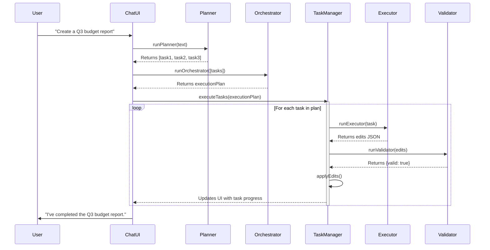

# Developer Book: AI-Powered Web Excel Editor

## 1. Overview

This document provides a technical guide to the AI-Powered Web Excel Editor, a client-side application built with vanilla HTML, CSS, and JavaScript. It integrates with OpenAI and Gemini models to provide multi-agent spreadsheet automation.

**Core Technologies:**
- **Frontend:** Vanilla JavaScript (ES6+), HTML5, Tailwind CSS
- **Spreadsheet Engine:** SheetJS (XLSX) for workbook manipulation
- **AI Providers:** OpenAI (GPT models), Google (Gemini models)
- **Storage:** IndexedDB for persistent workbook and state storage

---

## 2. Quick Start

### Prerequisites
- A modern web browser (Chrome, Firefox, Safari, Edge)
- API keys for OpenAI and/or Google Gemini

### Setup
1.  Clone the repository.
2.  Open `index.html` directly in your browser.
3.  Use the UI to set your API keys, which are stored locally in the browser.

---

## 3. Architecture

The application operates entirely on the client-side.

-   **UI Layer:** The user interacts with a spreadsheet grid, a chat panel, and a task manager.
-   **Application Logic (`app.js`):** Manages state, UI rendering, and orchestrates AI agent calls.
-   **AI Agents:** A multi-agent system (Planner, Executor, Validator) breaks down user requests, generates spreadsheet operations, and validates them.
-   **LLM Connectors:** Simple wrappers around the `fetch` API to call OpenAI and Gemini endpoints.
-   **Persistence Layer:** IndexedDB stores workbooks, tasks, and application state.

### Project Structure
```
/
├── index.html            # Main entry point with redirect
├── DEVELOPER_BOOK.md     # This document
├── README.md             # General project overview
└── web/
    ├── app.js            # Core application logic
    ├── index.html        # Main application HTML
    ├── styles.css        # Tailwind CSS styles
    ├── FormulaEngine.js  # Handles formula calculations
    ├── core/
    │   └── state.js      # Global application state management
    ├── db/
    │   └── indexeddb.js  # IndexedDB wrapper for storage
    ├── spreadsheet/
    │   ├── grid-renderer.js
    │   ├── sheet-manager.js
    │   └── workbook-manager.js
    └── ui/
        ├── modal.js      # Modal component
        └── toast.js      # Toast notification component
```

---

## 4. Core Implementation Details

### AI Operation Schema
The AI **Executor** agent's primary role is to return a JSON object that defines spreadsheet modifications. This schema is the contract between the AI and the frontend.

**Schema:**
```json
{
  "edits": [
    {"op": "setCell", "sheet": "Sheet1", "cell": "A1", "value": "Total"},
    {"op": "setRange", "sheet": "Sheet1", "range": "A2:C3", "values": [["a", 1], ["b", 2]]},
    {"op": "insertRow", "sheet": "Sheet1", "index": 2, "values": ["x", 1, "y"]},
    {"op": "deleteRow", "sheet": "Sheet1", "index": 3}
  ],
  "message": "Applied 3 edits."
}
```

The `applyEdits` function in `app.js` parses this JSON and uses SheetJS utilities to modify the in-memory workbook.

### Multi-Agent System
-   **Planner:** Decomposes a high-level user request (e.g., "Create a budget for Q3") into a series of smaller, actionable tasks.
-   **Executor:** Takes a single task and generates the corresponding JSON `edits` based on the operation schema.
-   **Validator:** Performs a sanity check on the JSON output from the Executor to ensure it's well-formed and won't perform destructive actions without confirmation.

**System Prompts (Simplified):**
-   **Planner:** `You are Planner. Return a JSON array of short, actionable tasks with an id, title, and description.`
-   **Executor:** `You are Executor. You MUST output a single JSON object conforming to the Operation Schema. Only output JSON.`
-   **Validator:** `You are Validator. You will receive Executor JSON. Return {"valid": true} or {"valid": false, "errors": [...]}.`

### Persistence with IndexedDB
The application uses an IndexedDB wrapper (`db/indexeddb.js`) to provide robust client-side storage, overcoming the limitations of `localStorage`.

**Stores:**
-   `workbooks`: Stores workbook data, including all sheets, cells, and metadata.
-   `tasks`: Persists the state of AI-generated tasks.
-   `history`: Stores snapshots of the workbook state to enable undo/redo functionality.

### State Management
A global `AppState` object (`core/state.js`) holds the application's current state, including:
-   The active workbook (`wb`).
-   The active sheet name.
-   A list of all sheets.
-   Tasks and chat messages.
-   Undo/redo history stacks.

This centralized state object is used throughout the application to ensure data consistency.

---

## 5. Key Code Snippets

### Calling an AI Provider (OpenAI Example)
```javascript
// Location: services/ai-agents.js
async function fetchOpenAI(apiKey, messages, model = "gpt-4o") {
  const res = await fetch("https://api.openai.com/v1/chat/completions", {
    method: "POST",
    headers: {
      "Content-Type": "application/json",
      "Authorization": `Bearer ${apiKey}`
    },
    body: JSON.stringify({ model, messages })
  });
  const data = await res.json();
  return data;
}
```

### Applying Edits to the Workbook
```javascript
// Location: spreadsheet/workbook-manager.js (Simplified Pseudocode)
function applyEdits(wb, edits) {
  const ws = wb.Sheets[edits.sheet || Object.keys(wb.Sheets)[0]];
  for (const edit of edits) {
    switch(edit.op) {
      case "setCell":
        ws[edit.cell] = { t: 's', v: edit.value }; // Type and value
        break;
      case "setRange":
        XLSX.utils.sheet_add_aoa(ws, edit.values, { origin: edit.range.split(":")[0] });
        break;
      // ... other operations
    }
  }
  // After applying all edits, re-render the grid
  renderGrid();
}
```

---

## 6. Next Steps & Enhancements

While the application is fully functional, future work can focus on:
-   **AI Sophistication:** Improving the reasoning and context-awareness of the AI agents.
-   **Advanced Formulas:** Implementing a more robust formula engine that can handle cross-sheet dependencies.
-   **Collaboration:** Adding real-time, multi-user collaboration features.
-   **Performance:** Optimizing rendering for very large datasets (e.g., virtual scrolling).

---

### 7. Enhanced Agent Workflow (Proposed)

The current multi-agent system is effective but requires manual intervention to execute each task. This section outlines an enhanced, automated workflow to improve speed and user experience.

#### Current Workflow Limitations

1.  **Manual Execution:** The user must manually click "Execute" on each task generated by the Planner.
2.  **Slow Feedback Loop:** The process is sequential and waits for user input, making complex, multi-step operations feel slow.
3.  **Underutilized Orchestrator:** The `runOrchestrator` function exists but is not a central part of the primary workflow.

#### Proposed Automated Workflow

The new workflow will automate task execution by default, providing a more fluid, conversational experience. The user can still intervene, but the system will proceed autonomously otherwise.

1.  **User Input:** The user provides a request in the chat.
2.  **Planning:** The **Planner Agent** decomposes the request into a set of tasks with dependencies, as before.
3.  **Orchestration:** The **Orchestrator Agent** is immediately called to analyze the tasks and create an optimized execution plan. It will determine the best order and potential for parallel execution.
4.  **Automated Execution:** The **Task Manager** executes the plan automatically. It will call the **Executor** and **Validator** agents for each task in the orchestrated sequence.
5.  **Real-time Feedback:** The UI will provide real-time feedback on the progress of the tasks, updating their status as they are executed.
6.  **Completion:** The system notifies the user upon completion of all tasks.

This automated flow will be the default behavior when `autoExecute` is enabled.

#### Visualizing the New Flow



#### Required Code Changes

1.  **`web/chat/chat-ui.js` (`onSend` function):**
    *   After `runPlanner` returns tasks, immediately call `runOrchestrator` from `task-manager.js`.
    *   Instead of waiting for user clicks, call `executeTasks` with the plan from the orchestrator if `autoExecute` is on.
    *   Update the AI's response to inform the user that the tasks are being executed automatically.

2.  **`web/tasks/task-manager.js`:**
    *   Ensure `executeTasks` can handle the output from `runOrchestrator` gracefully.
    *   Improve real-time feedback mechanisms within `drawTasks` to better reflect the in-progress state.

This approach will significantly improve the agent's autonomy and speed, creating a more powerful and intuitive user experience.